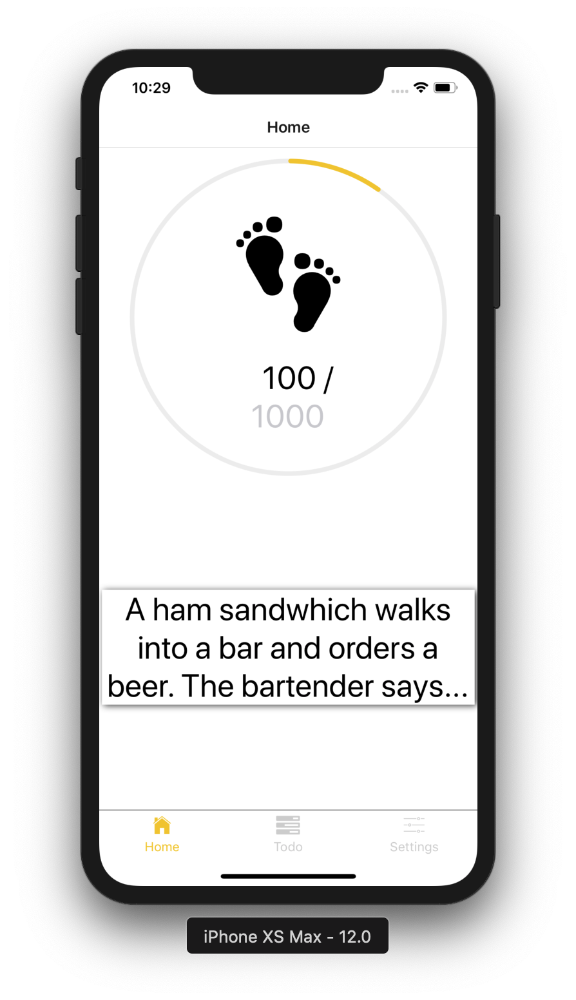

# Boost
Boost er en applikasjon som skal gjøre brukerens hverdag enklere. Applikasjonen er delt i tre, en del for å gi deg motivasjon, en for å gi deg glede og en for å ta kontroll over hverdagen din.

## App’en vår
Består av tre skjermer man kan navigere mellom ved hjelp av tabs: en hjemskjerm, en todo-skjerm og en setting-skjerm. De to første er utstyrt med komponenter og funksjonalitet. Den siste er tatt med fordi det rett og slett følger material design med tre tabs/skjermer å navigere mellom. Den er tom fordi de to andre skjermene tilfredsstiller funksjonalitet- og teknologi kravene som oppgaven stiller. Det var heller aldri vårt mål å lage noe mer enn en prototype eller demonstrere noe utover det oppgaveteksten beskrev.

### Home tab
Øverste del av skjermen består av en skritteller. Denne holder styr på skrittene du har gått siden midnatt samme dag i en teller under føttene. Tallet før skråstreken er skrittene du har tatt. Tallet etter skråstreken kan man endre på ved klikk og brukerinput. Dette setter målet ditt for dagen. Sirkelen rundt er ‘progress-bar’ som viser visuelt hvor mange skritt du har tatt i forhold til målet.

Nederste del av skjermen består av en uthevet boks som kan trykkes på. Den første( og sorte) teksten er en intro til en vits. Ved klikk kommer avslutningen på vitsen. Denne teksten er gul. Ved nytt klikk genereres en ny vits og slik fortsetter det til man spyr av vitser. Dette gir deg virkelig motivasjonen og gleden du trenger for å komme deg gjennom en hektisk hverdag!

### Todo tab
Dette er en skjerm som skal reflektere en todo-liste fra den virkelige verdenen. Her kan man legge til tasks øverst. Man kan også fjerne taske ved å swipe tasks mot venstre. Todos blir selvfølgelig lagret mellom hver gang man lukker og åpner applikasjonen. Under ser man hvordan applikasjonen ser ut på en iPhone Xs.

 

## Grunnlag for våre løsninger
Appen vår er i bunn å grunn bygget videre på eksempel-applikasjonen som Expo setter i gang etter kommandoen “expo-init”. Dette synes mest i tabsene og navigerings-logikken mellom de ulike skjermene. Vi valgte denne løsningen fordi det reflekterte vår skisserte løsning bra. Tabsene skaper en fin intuisjon om hvordan man kan navigere mellom skjermene.

Vi vil gjerne understreke at dette ikke betyr at vi blindt har stolt på det expo tilbyr av ferdig funksjonalitet, men at vi har brukt god tid til å forstå utvikler-miljøet som tilbys her. For eksempel lagde et issue for å fjerne/rydde all kode og funksjonalitet som vi så var unødvendig for vår applikasjon. Dette krevde at vi satt oss inn det som stod der, noe som gav oss en god forståelse over verktøyet vi ble tilbudt. 

Komponentene på skjermene er i stor grad designet av oss uten mye avhengighet av eksterne biblioteker og api’er. Utenom komponentene fra ‘react-native-naviation’-api’et er det kun på laveste nivå i komponent-hierarkiet hvor vi har brukt tredjeparts komponenter. Dette gjorde vi fordi det gav oss mye frihet til implementasjon og samtidig få oppfylt kravene som ble stilt. 

Vi valgte å lage en joke-komponent. Dette gjorde vi fordi vi syntes det var gøy, men samtidig for å poengtere motivasjons-aspektet ved applikasjonen. I Joke-komponenten vår har vi brukt fetchAPI for å hente data fra det åpne apiet "official joke api". Vi valgte å brukte fetchAPI fordi det gir deg et interface som er utrolig enkelt å bruke og vi synes den gir en veldig intuitiv og logisk måte å fetche ressurser asynkront.

Skritteller-komponenten ble valgt for å demonstrere implementasjon av kravene om å vise “noe som er utover basic React Native UI-problematikk”. Den demonstrerer også bruk av Async storage. Komponenten består av sub-komponenten “ProgressCircle” fra “react-native-svg-charts”-biblioteket (“progressbar”-en som rendres) og en Pedometer-komponent som er hentet fra Expo-apiet. Denne gir oss tilgang til mobilens skritteller  og asynkrone lagre-og hentemetoder. 
Se nederst i dokumentet for kommentarer på funskponalitet på skrittelleren vår.

Todo-komponenten skal demonstrere oppfølging av kravene om å kunne legge til/fjerne elementer og lagre/hente dem asynkront. Vi valgte dette fordi det er intuitivt, men samtidig virket det gøy og overkommelig å gjennomføre. Komponenten består av komponentene AddTask og ScrollView. Scrollview kan ha flere Task komponenter som children. Scrollview er en komponent som kommer med react native og gjør det utrolig enkelt å ha en “scrollbar”-liste i mobilapplikasjonen din. Det eneste man trenger å gjøre er å legge en liste med komponenter inne i den og så ordner den resten. Vi har også hentet inn Swipeout-komponenten fra ‘react-native-swipout’-biblioteket for å implementere fjerning av tasks. Dette oppsummerer egentlig hvordan vi legger til og fjerner elementer (tasks).

Etter vi ble ferdig med todo komponenten innsåg vi at det var noen forbedringer vi kunne gjort. For eksempel kunne task komponenten vært en funksjonell komponent, ettersom den har ingen state. I tillegg innser vi at det er vanskelig å forstå at man skal swipe en task til venstre for å bli ferdig med den. Men ettersom dette er en prototype lar vi dette stå.

Vi importerer også AsynStorage fra ‘react.native’ for å lagre asynkront. Dette beskrives lengre nede.

## Teknologier

### React Native
Applikasjonen vår er laget ved hjelp av rammeverket react native. Dette rammeverket er basert på react, som er et javascript bibliotek for å lage nettapplikasjoner. React native lar deg bygge mobilapplikasjoner som fungerer både på android og iOS. Mange fordeler kommer med dette rammeverket, for eksempel slipper man å rekompilere og kan bruke native kode (skrive komponenter i Java, Swift, Objective-c der du trenger det).

Vi hadde svært gode erfaringer med å bruke dette rammeverket. Overgangen fra React gikk svært fort. De største forandringene vi var react-native sine komponenter feks. View, Text, ScrollView osv. I Tillegg skriver man stylingen som javascript objekter istedenfor css, noe vi ble stor fan av. 

### Expo
Vi brukte Expo for å utvikle prosjektet vårt. Expo er et verktøy som er bygget rundt react native og lar deg komme fort i gang med utvikling av applikasjoner. Den tilbyr at Command Line Interface (CLI) for å enkelt dele, bygge og deploye applikasjoner. Man kan også bruke denne for å åpne et Expo UI i browseren din. Det følger også med Expo SDK: et bibliotek som gir tilgang til mange native ios-og android api’er som akselerometer, push-notifikasjoner, osv. En veldig nyttig feature er å laste ned Expo Client på mobilen: en applikasjon som i samspill med Expo CLI lar deg build’e prosjektet rett på telefonen! Man kan også bruke simulatorer som f.eks Xcode viss man vil.
Vi hadde ingen problemer med å bruke expo under utviklingen og vil absolutt anbefale alle som er nye til react native å bruke dette.

### Git
Vi brukte versjonskontroll systemet git for å sammarbeide på utviklingen. Dette fungerte svært bra ettersom vi begynner å bli bedre kjent med git. Når man bruker dette systemet er det viktig å bestemme seg for en workflow og ha regler for navngiving. 

Det første vi gjorde når vi startet prosjektet var å lage en develop branch, det var her utviklingen ville foregå. Utifra denne branchen lagde vi branches for ulike features og issues som de hørte til. Vi valgte å bruke merging over rebasing. Dette er ettersom vi er begge kjent med merge fra før av og at det hjelper oss i å kunne se tilbake i commitsene fra feks. Feature branches. 

Vi begynte navngivingen av branchene våre med “issueID-beskrivelse”, men gikk etterkvert over til mer spesifikk navngiving feks. feat/issueID/beskrivelse. Dette synes vi fungerte bedre ettersom det ble enklere å kategorisere branchene og forstå hva det andre gruppemedlemmet drev på med. Commits ble i begynnelsen ikkje alltid markert med issue, noe vi innsåg kunne bli problematisk ettersom det ble svært vanskelig å finne igjen commits i commithistorien. 

## Tredjeparts komponenter

### Swipeout
For å fjerne en task fra TodoScreen komponenten må man swipe til venstre på en task. Da vil en fin animasjon gi deg en “Done” knapp. For å få dette til brukte vi tredjeparts biblioteket react-native-swipeout. Biblioteket gjør det utrolig enkelt å ha swipeout animasjoner med et ulikt antall knapper.

For å installere:
```
npm install --save react-native-swipeout
```

For å bruke det:
```javascript
import Swipeout from 'react-native-swipeout';
// Buttons
var swipeoutBtns = [
  {
    text: 'Button'
  }
]

// Swipeout component
<Swipeout right={swipeoutBtns}>
  <View>
    <Text>Swipe me left</Text>
  </View>
</Swipeout>
```
Stylingen endrer du i objektet swipeoutBtns. For å se props til komponenten sjekk ut https://github.com/dancormier/react-native-swipeout

### ProgressCircle
Skriv følgende for å inkludere komponenten og rendre den. Props’ene i eksempelet må være med for at den skal rendres. Husk å kjør npm install etter importen. 
```javascript
import React from 'react'
import { ProgressCircle }  from 'react-native-svg-charts'

class ProgressCircleExample extends React.PureComponent {
    render() {
        return (
            <ProgressCircle
                style={ { height: 200 } }  // gir den en størrelse
                progress={ 0.7 }  // gir den progresjon
                progressColor={'rgb(134, 65, 244)'}  // farge på progresjon
            />
        )
    }
}
```
### Pedometer
En komponent som er hentet fra Expo SDK’en og er ekstremt lett å bruke. Følgende kode må implementers:

Først importer:
```javascript
import Expo from "expo";
import { Pedometer } from "expo";
```
Derretter må state settes i komponenten din:
```
  state = {
    currentStepCount: 0
  };
```
For å legge til en ‘lytter’ på mobilens pedometer, implementer:
```javascript
this._subscription = Pedometer.watchStepCount(result => {
      this.setState({
        currentStepCount: result.steps
      });
    });
```
Merk: Denne vil endre state slik at den oppdateres hver gang det skjer et nytt skritt! Implementer gjerne i didMount-metoden til komponenten

Man vil også kunne avlutte ‘lytteren’ når komponenten rived ned. Implementer i willUnmount.
```javascript
this._subscription && this._subscription.remove();
this._subscription = null;
```

Det finnes også metoder for å laste skritt asynkront fra andre tidsperioder, og for å sjekke om pedometer i det hele tatt er tilgjengelig. Sjekk koden vår for en mer detaljert implementasjon.
Kommentarer i koden viser godt hvordan det fungerer.

### React navigation
Sjekk ut AppNavigator i navigation-mappen vår. Det er ganske detaljert forklart i kommentarer hvordan det virker og koden fungerer som et bra eksempel. Deretter kan du see i screens-mappen for å se hva som rendres på hver skjerm.

### Async storage
Async storage er react native sitt api for å lagre data på device. Apiet er asynkront, det vil si at det ikkje returnerer en verdi med det første. Du får tilbake et promise isteden! Grunnen til at vi valgte å bruke dette APIet er at det er enkelt og lagrer dataen “persistent”. Dataen blir lagret på devicet, det vil si at dersom du terminerer appen vil du kunne få tilbake dataen ved en ny økt.

Hvordan bruker du async storage?
Lagring av data på key:
```javascript
_storeData = async (data,myKey) => {
  try {
    await AsyncStorage.setItem('myKey', 'data')
  } catch (error) {
    // Error saving data
  }
}
```
Fetche data:
```javascript
_retrieveData = async (myKey) => {
  try {
    const value = await AsyncStorage.getItem(myKey');
    if (value !== null) {  // We have data!!
      console.log(value);
    }
   } catch (error) {
    // Error retrieving data
   }
}
```

Da har du alt du trenger for å kunne bevare dataen din mellom applikasjons “økter”!

### Expo
Expo er verktøyet som lar deg komme fort igang med utviklingen av react native applikasjoner. For å komme igang må du først laste ned NodeJs. For å installere expo:
```
npm install expo-cli --global
```

For å lage ditt første prosjekt:
```
expo init my-new-project
cd my-new-project
expo start
```

Da skal verktøyet til expo være oppe og kjøre i nettlesern din. Dersom det ikkje er dette kan du skrive inn addressen localhost:19002 i nettlesern din.

## Testing
Under utviklingen har vi testet applikasjonen på både ios og android. Henholdvis en iPhone Xs, iPhone 5, LG Nexus 5X og en Samsung Galaxy Note 3. Sørget for at brukergrensesnittet var responsivt og at applikasjonen fungerte på begge operativsystem. 

Testing av koden har foregått ved hjelp av Jest. Mesteparten av testene våre er snapshot tester, ettersom det det var svært få enhetstester vi kunne utføre. Vi hadde to funksjoner som kunne enhetstestes, resten forandret på state og var ikkje mulig å bryte opp i mindre testbare deler. 

### Ettertanker/Kommentarer
Innsåg i etterkant at lagringen til async storage ikkje blir brukt optimalt. Slik som det er nå så lagres dataen hver gang en ny task bli lagt til eller fjernet. Dette er kostbart! Dersom vi skulle fullført denne prototypen ville vi flyttet lagringen til componentWillUnmount() i TodoScreen komponenten. Grunnen til at dette har skjedd er nok at vi ikke hadde en god nok forståelse av react sin lifecycle i starten av prosjektet.

Som det står over ville vi også gitt task komponenten bedre affordance. Slik det er nå er det vanskelig å vite at man skal swipe komponenten for å bli ferdig med en task. 

Vi er også klar over at skritteller-komponentens funskjonalitet ikke alltid er tilstede. Etter å ha snakket med andre grupper fant vi ut at vi ikke er det eneste med dette problemet. Det har seg slik at ved mounting vil MotivatingPedometer prøve å hente data (tidligere skritt) fra et api som har tilgang mobilens skritteller-program(helse viss ios, googleFit viss android). Dette api har vist seg å være svært upolitelig når prosjektet buildes i expo gjentatte ganger. Men det har fungert til tider og vi etter sammenlikning med andre studenter og oguider på nett, er overbevist om at koden vår er riktig.
Når den ikke klarer å komunisere via api-et vil skrittelleren ha en default-startverdi på 100 skritt.

